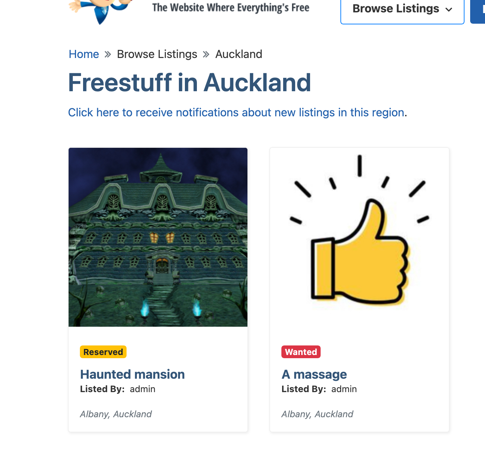
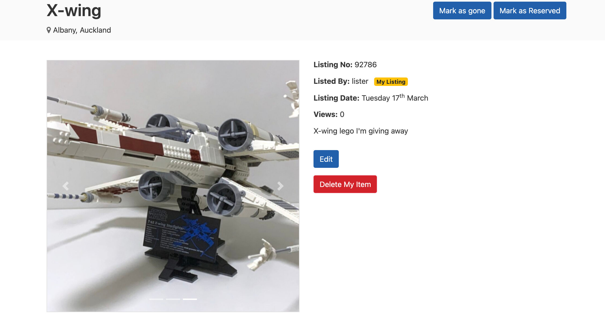
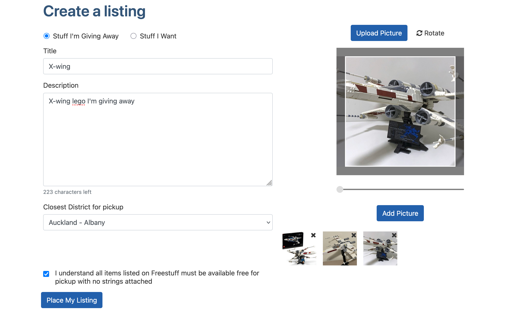
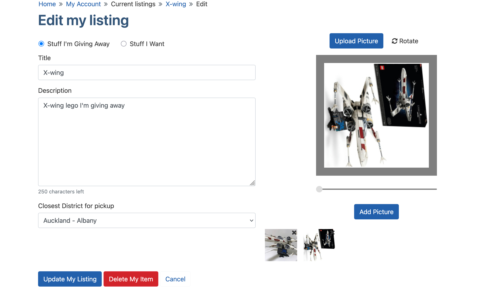

**Issue**: Docker does not run image freestuff-php on Windows.\
**Console output**: 
```
freestuff-php      | exec /start.sh: no such file or directory
freestuff-php exited with code 255
```
**Fix**: Change /start.sh end of line sequence from CRLF to LF.

---
**Issue**: Warning box appears in footer after the website is built and running.\
`Warning: file_put_contents(/home/freestuff/storage/cache/stats.html): Failed to open stream: No such file or directory in /home/freestuff/public_html/front_end/templates/common_footer.php on line 62`\
It appears that the file `storage/cache/stats.html` does not exist.\
**Fix**: Initialise a stats.html file at the stated location, it can be empty. This can be a part of /start.sh.

---
**Feature change**: Showing reserved status when browsing listings.\
Currently, reserved listings have no visual difference compared to available listings unless the user clicks into the listing. This change adds a badge to indicate a listing is reserved while browsing, and should help users quickly know which listings are reserved and not open to requests.\


---
**Feature change**: Upload multiple pictures.\
This change allows a user to upload multiple pictures to a listing, with an image gallery on the listing's page. The first uploaded image would be used as the thumbnail for browsing, so that it is consistent with the first picture someone sees when going to a listing's page.

Image carousel using bootstrap displays multiple images on listing page.


After uploading a picture and tweaking it with croppie, the user can add the picture to a list of pictures for the listing, with ability to remove unwanted pictures.


When editing an existing listing, the list of pictures can still be modified, with the user being able to add or remove any picture at will.


